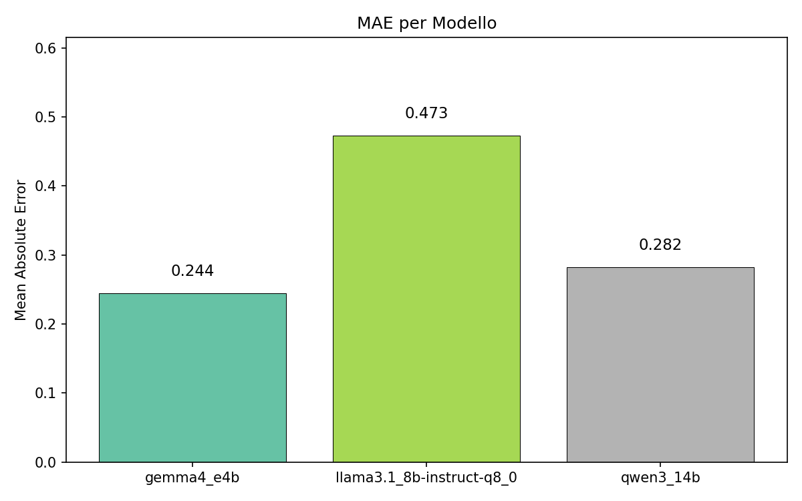
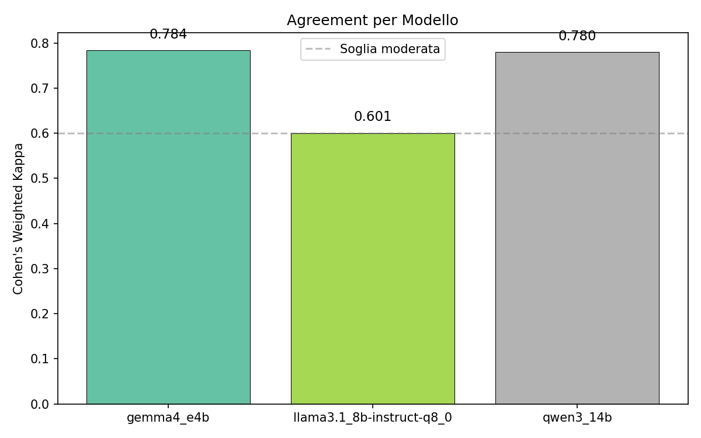
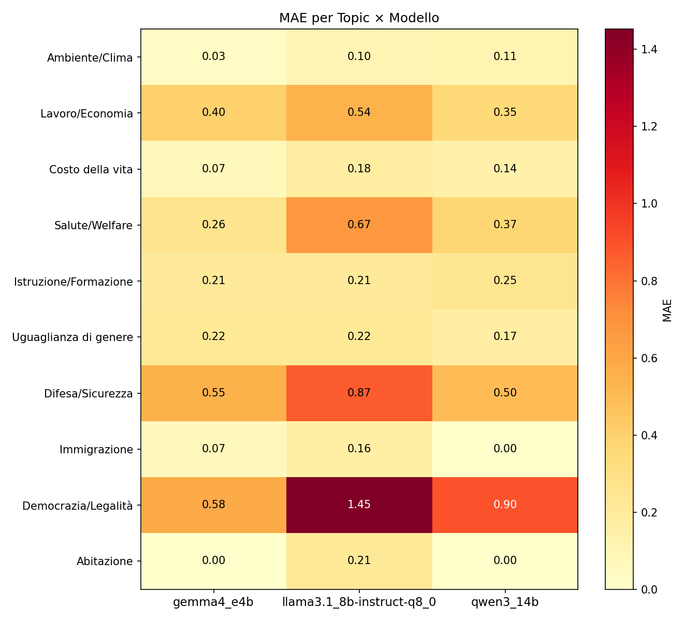
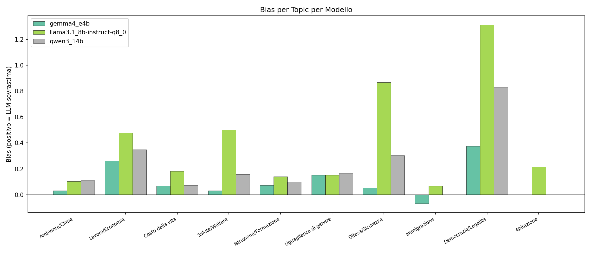

# Risultati Validazione LLM vs Annotazioni Umane

> Report generato il 2026-04-26 13:50

**Modelli confrontati**: GEMMA4_E4B, LLAMA3.1_8B-INSTRUCT-Q8_0, QWEN3_14B  
**Politici analizzati**: ellyesse, giorgiameloni, giuseppeconte_ufficiale  
**Scala di valutazione**: 1-5 (1=non rilevante, 5=molto rilevante)  
**Topic valutati**: 10  

## Metodologia

Ogni modello LLM è stato confrontato con la media (arrotondata per difetto) delle annotazioni di 4 annotatori umani su 10 post per 3 politici (30 post totali, 10 topic ciascuno).

### Metriche utilizzate

| Metrica | Descrizione |
|---------|-------------|
| **Cohen's Weighted Kappa (κ)** | Accordo tra rater, corretto per il caso. Pesi quadratici. κ<0.20=scarso, 0.20-0.40=discreto, 0.40-0.60=moderato, 0.60-0.80=buono, >0.80=eccellente |
| **Spearman's ρ** | Correlazione ordinale tra voti umani e LLM |
| **MAE** | Errore medio assoluto (in punti sulla scala 1-5) |
| **Wilcoxon Signed-Rank** | Test non parametrico per bias sistematico (p<0.05 = bias significativo) |
| **Krippendorff's α** | Reliability inter-rater per dati ordinali |

---

## 🏆 Classifica Modelli

| # | Modello | MAE | Kappa (κ) | Livello | Spearman ρ | Krippendorff α | Bias |
|---|---------|-----|-----------|---------|------------|----------------|------|
| 🥇 | **GEMMA4_E4B** | 0.244 | 0.784 | Buono | 0.742 | 0.783 | 0.096 ⚠️ |
| 🥈 | **QWEN3_14B** | 0.282 | 0.780 | Buono | 0.757 | 0.778 | 0.211 ⚠️ |
| 🥉 | **LLAMA3.1_8B-INSTRUCT-Q8_0** | 0.473 | 0.601 | Buono | 0.728 | 0.588 | 0.412 ⚠️ |

> Il modello più accurato è **GEMMA4_E4B** con un MAE di **0.244** e un Kappa di **0.784** (Buono).

---

## Grafici

### MAE per Modello

### Agreement (Kappa) per Modello

### Heatmap MAE per Topic × Modello

### Bias per Topic

---

## Dettaglio per Politico

### ellyesse

| Modello | N | MAE | Kappa | Spearman ρ | Wilcoxon p | Bias |
|---------|---|-----|-------|------------|------------|------|
| GEMMA4_E4B | 90 | 0.278 | 0.810 (Eccellente) | 0.817 | 0.0830 | 0.122 |
| QWEN3_14B | 100 | 0.370 | 0.757 (Buono) | 0.768 | 0.0013 ⚠️ | 0.250 |
| LLAMA3.1_8B-INSTRUCT-Q8_0 | 90 | 0.578 | 0.581 (Moderato) | 0.698 | 0.0000 ⚠️ | 0.533 |

### giorgiameloni

| Modello | N | MAE | Kappa | Spearman ρ | Wilcoxon p | Bias |
|---------|---|-----|-------|------------|------------|------|
| GEMMA4_E4B | 80 | 0.138 | 0.746 (Buono) | 0.636 | 0.0469 ⚠️ | 0.113 |
| QWEN3_14B | 90 | 0.178 | 0.783 (Buono) | 0.591 | 0.0027 ⚠️ | 0.156 |
| LLAMA3.1_8B-INSTRUCT-Q8_0 | 70 | 0.329 | 0.386 (Discreto) | 0.519 | 0.0215 ⚠️ | 0.271 |

### giuseppeconte_ufficiale

| Modello | N | MAE | Kappa | Spearman ρ | Wilcoxon p | Bias |
|---------|---|-----|-------|------------|------------|------|
| QWEN3_14B | 90 | 0.289 | 0.795 (Buono) | 0.819 | 0.0010 ⚠️ | 0.222 |
| GEMMA4_E4B | 100 | 0.300 | 0.752 (Buono) | 0.716 | 0.3498 | 0.060 |
| LLAMA3.1_8B-INSTRUCT-Q8_0 | 100 | 0.480 | 0.680 (Buono) | 0.822 | 0.0000 ⚠️ | 0.400 |

---

## Analisi per Topic

### GEMMA4_E4B

| Topic | MAE | Bias | Interpretazione |
|-------|-----|------|-----------------|
| Ambiente/Clima | 0.033 | 0.033 (neutro) | ✅ Ottimo |
| Lavoro/Economia | 0.402 | 0.261 (sovrastima) | 🟡 Accettabile |
| Costo della vita | 0.070 | 0.070 (sovrastima) | ✅ Ottimo |
| Salute/Welfare | 0.257 | 0.032 (neutro) | 🟡 Accettabile |
| Istruzione/Formazione | 0.207 | 0.074 (sovrastima) | 🟡 Accettabile |
| Uguaglianza di genere | 0.218 | 0.152 (sovrastima) | 🟡 Accettabile |
| Difesa/Sicurezza | 0.548 | 0.052 (sovrastima) | 🔴 Critico |
| Immigrazione | 0.067 | -0.067 (sottostima) | ✅ Ottimo |
| Democrazia/Legalità | 0.582 | 0.374 (sovrastima) | 🔴 Critico |
| Abitazione | 0.000 | 0.000 (neutro) | ✅ Ottimo |

### LLAMA3.1_8B-INSTRUCT-Q8_0

| Topic | MAE | Bias | Interpretazione |
|-------|-----|------|-----------------|
| Ambiente/Clima | 0.104 | 0.104 (sovrastima) | ✅ Ottimo |
| Lavoro/Economia | 0.544 | 0.477 (sovrastima) | 🔴 Critico |
| Costo della vita | 0.181 | 0.181 (sovrastima) | ✅ Ottimo |
| Salute/Welfare | 0.670 | 0.500 (sovrastima) | 🔴 Critico |
| Istruzione/Formazione | 0.207 | 0.141 (sovrastima) | 🟡 Accettabile |
| Uguaglianza di genere | 0.218 | 0.152 (sovrastima) | 🟡 Accettabile |
| Difesa/Sicurezza | 0.867 | 0.867 (sovrastima) | 🔴 Critico |
| Immigrazione | 0.162 | 0.067 (sovrastima) | ✅ Ottimo |
| Democrazia/Legalità | 1.453 | 1.312 (sovrastima) | 🔴 Critico |
| Abitazione | 0.215 | 0.215 (sovrastima) | 🟡 Accettabile |

### QWEN3_14B

| Topic | MAE | Bias | Interpretazione |
|-------|-----|------|-----------------|
| Ambiente/Clima | 0.111 | 0.111 (sovrastima) | ✅ Ottimo |
| Lavoro/Economia | 0.348 | 0.348 (sovrastima) | 🟡 Accettabile |
| Costo della vita | 0.141 | 0.074 (sovrastima) | ✅ Ottimo |
| Salute/Welfare | 0.374 | 0.159 (sovrastima) | 🟡 Accettabile |
| Istruzione/Formazione | 0.248 | 0.100 (sovrastima) | 🟡 Accettabile |
| Uguaglianza di genere | 0.167 | 0.167 (sovrastima) | ✅ Ottimo |
| Difesa/Sicurezza | 0.504 | 0.304 (sovrastima) | 🔴 Critico |
| Immigrazione | 0.000 | 0.000 (neutro) | ✅ Ottimo |
| Democrazia/Legalità | 0.896 | 0.830 (sovrastima) | 🔴 Critico |
| Abitazione | 0.000 | 0.000 (neutro) | ✅ Ottimo |
